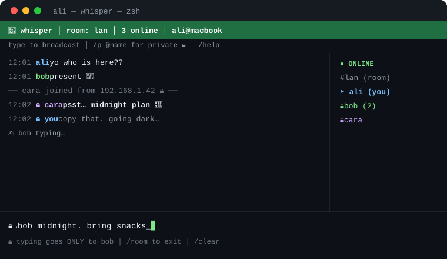

# 🤫 whisperlan — terminal whispers for your LAN

[](LICENSE)
[](whisper.py)
[](whisper.py)
[](whisper.py)

**Same WiFi. No server. No account. Just type.**

`whisperlan` turns every laptop on your local network into a chatroom — plus encrypted 1-on-1s. One Python file, zero dependencies, macOS + Linux. The command stays short: type `whisper` (or `whisperlan`, same thing).



> 🎥 That's a static mock. To record a real demo: `brew install vhs` (or asciinema), run two `whisper --name …` sessions side by side, export to `docs/demo.gif`, and swap the image link above. Real typing demos convert 10x better than mockups.

```
┌─────────────────────────────────────────────────┐
│ 🤫 whisper │ room: lan │ 3 online               │
│ type + enter to send │ /p @name private │ /help │
│ 12:01 ali            yo who is here??           │
│ 12:01 bob            present 🫡                 │
│ ── cara joined from 192.168.1.42 🔒 ──          │
│ 🔒→bob  secret plan at midnight_                │
│──────────────────────┼─ ● ONLINE ───────────────│
│ 🔒→bob secret plan…  │ ➤ #lan (room)            │
└──────────────────────┴──────────────────────────┘
```

## ⚡ Install (30 seconds)

**Option A — one-liner (recommended):**
```bash
curl -fsSL https://raw.githubusercontent.com/Tarraf2020/whisperlan/main/install.sh | bash
```

**Option B — clone:**
```bash
git clone https://github.com/Tarraf2020/whisperlan.git
cd whisper
./install.sh
```

**Option C — pip:**
```bash
pip install git+https://github.com/Tarraf2020/whisperlan.git
```

> Forked it or renamed your repo? Set `REPO=you/name`:
> `curl -fsSL ... | REPO=you/name bash`
> Don't forget to replace `Tarraf2020/whisperlan` in this README + `pyproject.toml` with your repo path.

Requires: **Python 3.8+** (stdlib only — `curses`, `socket`, `ssl`). No packages to install.

## 🔄 Update

Just re-run the installer (it overwrites + keeps your name/history):
```bash
curl -fsSL https://raw.githubusercontent.com/Tarraf2020/whisperlan/main/install.sh | bash
```
No need to check manually — whisperlan tells you inside the app: a 🔔 line appears when a peer runs a newer version, or when GitHub has one (checked max once a day, silent when offline).

## 🚀 Use it

```bash
whisperlan --name ali
# short alias works too:
whisper --name ali
```

Friend on the **same WiFi**, same port:
```bash
whisper --name bob
```

You auto-discover each other in ~5 seconds. Flags: `-n` = name, `-p` = room port, `--pport` = private port, `-v` = version.

## 💬 Chat guide

| What | How |
|------|-----|
| Talk to everyone | just type + Enter |
| Private 1-on-1 🔒 | `/p @bob`, then type (prompt turns `🔒→bob`) |
| One private, no switch | `/dm @bob yo` or `@bob yo` |
| Back to group | `/room` |
| Rename | `/name newname` |
| Fun | `/me dances`, `/shrug`, `/flip`, `/unflip`, `/party` |
| Misc | `/online`, `/clear`, `↑/↓` scroll, `/quit` or `ctrl-C` |
| 💥 Panic | `/panic` → `/panic yes`: nukes YOUR local history (room + privates + log). Others keep theirs. |

Mention with `@name` in the room → they get a beep. Sidebar shows `(2)` unread badges for privates.

## 🔒 How private is private?

- **Room** = UDP broadcast to `255.255.255.255:54545`. Everyone running whisper on that port sees it. Wireshark sees it. Party banter only.
- **Private** = direct TLS-encrypted TCP to one peer (`port+1` by default, auto-bumped if busy). Cert self-generates once via system `openssl` → `~/.whisper-cert.pem`. Passive sniffers see gibberish.
- Honest limit: self-signed = TOFU, no CA, so a skilled *active* LAN attacker could MITM. Don't send bank passwords. 😉

Packet shape: JSON `{v, id, type, from, uid, to?, text, ts, ip, pport}`, types `hello / heartbeat / bye / msg / dm / typing / rename / me / priv / priv-typing`. Heartbeat 5s, timeout 15s. History → `~/.whisper.log`.

## 🛠 Troubleshooting

- **`whisper: command not found`** → open a NEW terminal (picks up `~/.local/bin` on PATH), or `export PATH="$HOME/.local/bin:$PATH"`.
- **Nobody sees me** → same WiFi? (guest networks isolate clients), same `--port`? firewall allowed the UDP popup?
- **Solo test** → two terminals: `whisper --name ali` + `whisper --name bob`.
- **Weird characters** → use iTerm2 / Ghostty / Kitty / Terminal.app.
- **Uninstall** → `./uninstall.sh`.

## 💖 Sponsor

If whisper made your LAN party better, fuel the next feature:

- Hit **⭐ Star** + GitHub **Sponsor** (button at the top, via `.github/FUNDING.yml`)
- Or Ko-fi: `whisperlan` (placeholder — swap in your real link)

> Maintainer: after `git push`, go to github.com → your repo → Settings → Sponsors (or ko-fi.com) and replace `Tarraf2020` / `whisperlan` in `.github/FUNDING.yml` with your real handles, or the button goes nowhere.

## 🤝 Contributing

PRs welcome! Keep it: **one file, zero deps, works on fresh macOS Python**. Run a syntax check before pushing:
```bash
python3 -m py_compile whisper.py
```

Ideas wanted: file drop (`/send`), emoji reactions, internet relay mode, Windows support.

## 📄 License

MIT — see [LICENSE](LICENSE). Do whatever you want, just keep the notice.

---
Made for LAN parties, classrooms, hackathons & dorm rooms. If it made your table laugh, leave a ⭐.
